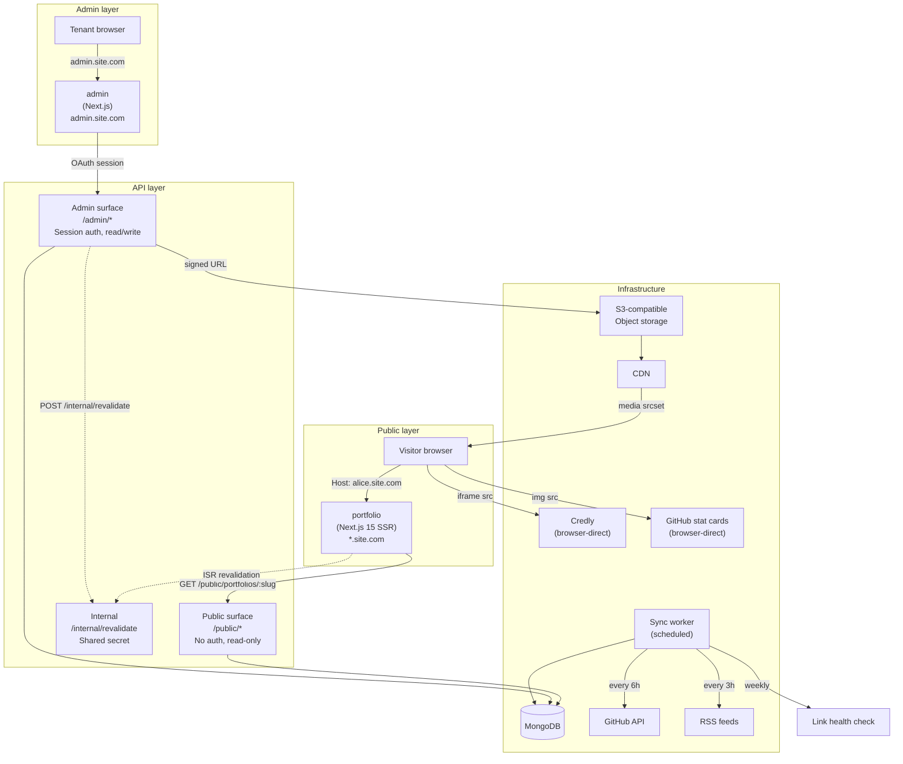

# Design Document — open-portfolio

## Overview

open-portfolio is a multi-tenant portfolio generator with three separately deployed
applications that share one framework-free registry package as their single source
of truth. The `portfolio` Next.js 15 app is substantially complete; this design
covers the remaining work: the NestJS API, the Admin Next.js panel, database schemas,
background sync worker, test infrastructure, and the plumbing that connects the
existing portfolio app to live data.

---

## Architecture

### System Diagram



### Deployable Boundaries

| App | Technology | URL | Auth | Purpose |
|---|---|---|---|---|
| `api` | NestJS | `api.site.com` | Two surfaces (see below) | All backend logic |
| `admin` | Next.js 15 | `admin.site.com` | OAuth session cookie | Tenant editing panel |
| `portfolio` | Next.js 15 SSR | `*.site.com` | None — fully public | Public-facing portfolios |
| `sync-worker` | Node.js (ts-node / compiled) | — | Internal cron | GitHub/RSS refresh, link checks |

The `packages/registry` workspace package is framework-free TypeScript consumed by
all three apps and the worker. It is never deployed on its own.

### Two API Surfaces

The NestJS API hosts two logically separate surfaces. They share nothing: separate
controllers, separate guards, separate DTOs, separate module registration.

- **Public surface** (`/public/*`) — unauthenticated, GET-only, returns published
  content only. Tenant is resolved from the slug in the URL path.
- **Admin surface** (`/admin/*`) — session-authenticated via httpOnly cookie,
  read/write. Tenant is resolved from the authenticated session, never from request
  parameters.

This separation is the enforcement point for FR-TEN-4 and NFR-SEC-1: a request to the
admin surface that supplies a different portfolio id in the body is silently scoped to
the session tenant anyway, making cross-tenant access impossible by construction rather
than by access-check.

---

## Components and Interfaces

### `api` — NestJS Application

```
src/
  main.ts                        Bootstrap, cookie-session, global pipes/filters
  app.module.ts

  auth/
    auth.module.ts
    github.strategy.ts           Passport GitHub OAuth
    google.strategy.ts           Passport Google OAuth
    session.serializer.ts        User → session / session → User
    auth.guard.ts                Session guard for admin surface
    auth.controller.ts           /auth/github, /auth/google, /auth/callback, /auth/logout

  public/
    public.module.ts
    public.controller.ts         GET /public/portfolios/:slug
    public.controller.spec.ts
    portfolio-public.dto.ts      Published response DTO (no internal fields)

  admin/
    admin.module.ts
    admin.controller.ts          All /admin/* endpoints
    admin.controller.spec.ts
    decorators/
      tenant.decorator.ts        @Tenant() — reads portfolio from session

  portfolio/
    portfolio.module.ts
    portfolio.service.ts         Draft/publish lifecycle, section CRUD
    portfolio.service.spec.ts
    publish.service.ts           Validate draft → copy to published → revalidate
    publish.service.spec.ts

  media/
    media.module.ts
    media.service.ts             Signed URL issuance, magic-byte validation, WebP derivatives
    media.service.spec.ts

  theme/
    theme.service.ts             Accent colour WCAG AA check, nearest-compliant shade

  integrations/
    integrations.module.ts
    github/
      github-sync.service.ts
    rss/
      rss-sync.service.ts
    ssrf.guard.ts                URL → SSRF rules (private ranges, redirect re-validation)

  credly/
    credly.service.ts            Import orchestration (calls importCredlyBadges from registry)
    badge-extract.service.ts     Wraps parseCredlyBadgeId from registry

  internal/
    revalidate.controller.ts     POST /internal/revalidate (shared-secret guard)

  common/
    filters/
      all-exceptions.filter.ts
    pipes/
      registry-validation.pipe.ts   Validates payloads against registry descriptors
    guards/
      shared-secret.guard.ts
    sanitiser/
      rich-text.sanitiser.ts     DOMPurify-server allowlist: p, ul, ol, li, strong, em, u, br
    encryption/
      field-encryption.service.ts  AES-GCM, key from outside DB (KMS or env secret)

  mongo/
    mongo.module.ts
    schemas/                     (see Data Model section)
```

### `admin` — Next.js Application

```
app/
  layout.tsx                   Root layout, session check, redirect to /sign-in
  page.tsx                     Dashboard — section list, enable/disable, reorder
  sign-in/
    page.tsx                   OAuth buttons → /api/auth/github, /api/auth/google
  sections/
    [type]/
      page.tsx                 Section editor — registry-driven form
  theme/
    page.tsx                   Accent colour picker, font selector, mode toggle
  seo/
    page.tsx                   Title, description, keywords, OG image upload
  preview/
    page.tsx                   Live draft preview (same section components as portfolio)
  integrations/
    page.tsx                   GitHub, RSS connections; Credly import UI
  publish/
    page.tsx                   Publish / unpublish with field-level error display

components/
  forms/
    RegistryForm.tsx           Reads a SectionDescriptor, renders fields in declared order
    FieldRenderer.tsx          Switches on FieldKind → correct input widget
    RichTextEditor.tsx         Restricted toolbar: p, lists, bold, italic, underline, br only
    TagInput.tsx
    ImageUpload.tsx            Calls /admin/media/upload-url, uploads direct to S3
  sections/
    SectionList.tsx            Drag-reorder, enable/disable toggles
    SectionItem.tsx
  preview/
    DraftPreview.tsx           iframe or RSC render of draft using portfolio components
  credly/
    CredlyImport.tsx           Bulk import from profile + single badge paste
  errors/
    FieldError.tsx             Renders FieldError[] adjacent to fields

lib/
  api-client.ts                Typed fetch wrapper for /admin/* endpoints
  session.ts                   Session helpers (server-side)
```

The Admin re-uses `@openportfolio/registry` for field descriptors and `PortfolioTheme`
types from the portfolio app's `lib/theme.ts` (published via the shared workspace).

### `portfolio` — Completions Required

The existing app only needs three targeted changes:

1. **`lib/api.ts`** — already calls `PORTFOLIO_API_URL`; remove the `USE_FIXTURES`
   branch from production builds. The fixture path stays for development.
2. **`next.config.ts`** — already has full CSP. No changes needed.
3. **`app/api/internal/revalidate/route.ts`** — already implemented; verify it uses
   `revalidateTag(portfolioTag(slug))` matching `lib/api.ts`.

### `sync-worker` — Standalone Node Process

```
src/
  worker.ts                    Entry point, cron schedule setup
  scheduler.ts                 node-cron wrappers with exponential backoff
  jobs/
    github-sync.job.ts         Fetches GitHub stats, writes integrationCache
    rss-sync.job.ts            Fetches RSS, caps at 10 posts, writes integrationCache
    link-health.job.ts         Checks project URLs, updates linkHealth, emails on 2 failures
  ssrf.ts                      Re-exported from a shared util — same rules as API
  mongo.ts                     Mongoose connection setup
  email.ts                     Minimal SMTP client for link-health notifications
```

---

## Data Models

All schemas use Mongoose with TypeScript. Sensitive fields (`credentials`,
`oauthToken`) are encrypted at rest by `field-encryption.service.ts` before
persisting (NFR-SEC-3). Decryption happens in the service layer, never in the DTO.

### `users`

```typescript
{
  _id:          ObjectId,
  provider:     'github' | 'google',
  providerId:   string,              // GitHub user id or Google sub
  email:        string,
  displayName:  string,
  avatarUrl:    string,
  createdAt:    Date,
  lastLoginAt:  Date,
  status:       'active' | 'suspended',
}
// Indexes:
//   unique compound (provider, providerId)
//   unique email
```

### `portfolios`

```typescript
{
  _id:              ObjectId,
  userId:           ObjectId,       // unique — one portfolio per tenant in v1
  slug:             string,         // unique, lowercase, validated against reserved list
  status:           'unpublished' | 'published' | 'suspended',
  registryVersion:  number,         // REGISTRY_VERSION at last write (FR-REG-4)
  presetId:         string,         // e.g. 'software-engineer'
  draft: {
    sections:  SectionInstance[],   // { type, enabled, order, content }
    theme:     PortfolioTheme,
    seo:       PortfolioSeo,
  },
  published: {                      // null until first publish
    sections:  SectionInstance[],
    theme:     PortfolioTheme,
    seo:       PortfolioSeo,
  } | null,
  slugHistory:      string[],       // old slugs retained for 90-day redirects
  publishedAt:      Date | null,
  version:          number,         // increments on each publish
  createdAt:        Date,
  updatedAt:        Date,
}
// Indexes:
//   unique userId
//   unique slug
//   slugHistory (sparse) — for 301 redirect lookup
```

`SectionInstance` is the registry type verbatim. Achievement items additionally carry
a per-item `published: boolean` flag (default `false` for Credly imports), living
inside the `content.items` array. The portfolio-level draft/publish split is
orthogonal — an unpublished badge simply does not get copied into the `published` tree
during the publish step.

### `media`

```typescript
{
  _id:         ObjectId,
  portfolioId: ObjectId,
  storageKey:  string,        // S3 object key
  url:         string,        // CDN URL
  mimeType:    string,
  bytes:       number,
  width:       number | null,
  height:      number | null,
  altText:     string,        // required at upload (FR-MED-5, NFR-A11Y-4)
  uploadedAt:  Date,
}
// Index: portfolioId
```

### `integrationConnections`

```typescript
{
  _id:                  ObjectId,
  portfolioId:          ObjectId,
  provider:             'github' | 'rss',
  config: {
    username?:  string,   // GitHub login
    feedUrl?:   string,   // RSS — validated against SSRF rules at write time
  },
  credentials:          Buffer,   // encrypted at rest — GitHub OAuth token
  status:               'ok' | 'failing' | 'revoked',
  lastSyncAt:           Date | null,
  lastError:            string | null,
  consecutiveFailures:  number,
}
// Index: portfolioId
```

GitHub stat cards and Credly badge identifiers deliberately have no row here. They are
stored in portfolio section content as URLs/identifiers and require no credential,
no token, and no refresh job (FR-INT-11, FR-INT-13).

### `integrationCache`

```typescript
{
  _id:         ObjectId,
  portfolioId: ObjectId,
  provider:    'github' | 'rss',
  payload:     unknown,    // shaped like GitHubPayload or RssPayload
  fetchedAt:   Date,
  expiresAt:   Date,
  stale:       boolean,    // true when last sync failed (FR-INT-3)
}
// Index: (portfolioId, provider) — unique compound
```

The public API merges integration cache payloads into the portfolio response
server-side. A stale cache is served unchanged; staleness is only visible in admin.

### `linkHealth`

```typescript
{
  _id:                  ObjectId,
  portfolioId:          ObjectId,
  sectionType:          'projects',
  itemId:               string,
  url:                  string,
  lastCheckedAt:        Date | null,
  statusCode:           number | null,
  state:                'ok' | 'broken' | 'unchecked',
  consecutiveFailures:  number,
}
// Index: portfolioId
```

### `auditLog`

```typescript
{
  _id:         ObjectId,
  portfolioId: ObjectId,
  userId:      ObjectId,
  action:      string,    // e.g. 'publish', 'section.update', 'media.delete'
  targetPath:  string,    // the modified path, e.g. 'sections.projects'
  timestamp:   Date,
  ipHash:      string,    // hashed client IP for traceability
}
// Index: (portfolioId, timestamp)
```

---

## API Surface Design

### Public Surface

```
GET  /public/portfolios/:slug
GET  /public/portfolios/:slug/sitemap.xml
```

`GET /public/portfolios/:slug` returns a `PortfolioPublicDto`:

```typescript
interface PortfolioPublicDto {
  slug:        string;
  sections:    SectionInstance[];     // enabled: true only, ordered by `order`
  theme:       PortfolioThemeDto;
  seo:         PortfolioSeoDto;
  publishedAt: string;
  version:     number;
}
```

Internal fields excluded by the DTO: `userId`, `email`, `draft`, all disabled
sections, `integrationConnections`, `credentials`, analytics ids (FR-API-1).

Integration cache payloads are merged into the relevant section's `content` before
serialisation: GitHub stats merge into `opensource.content.stats`, RSS posts merge
into `blog.content.items` when no manual items exist (manual wins per FR-INT-4).

Rate limiting: 60 req/min per IP via `@nestjs/throttler`. Edge cache TTL: 60 seconds.

### Admin Surface

All routes require a valid session cookie. Tenant scope comes from
`req.session.portfolioId` set at login — no URL parameter or body field is trusted.

```
GET   /admin/me                                       → UserDto
GET   /admin/portfolio                                → full draft + meta
PATCH /admin/portfolio/theme                          → ThemeUpdateDto
PATCH /admin/portfolio/seo                            → SeoUpdateDto
PATCH /admin/portfolio/slug                           → { slug: string }

GET   /admin/portfolio/sections                       → SectionInstance[]
PATCH /admin/portfolio/sections/:type                 → { enabled?, order?, content? }

POST  /admin/portfolio/sections/:type/items           → new item (collection types)
PATCH /admin/portfolio/sections/:type/items/:itemId   → partial item update
DELETE /admin/portfolio/sections/:type/items/:itemId

POST  /admin/media/upload-url                         → { uploadUrl, key, finalUrl }
DELETE /admin/media/:id

GET   /admin/integrations                             → IntegrationDto[]
POST  /admin/integrations/:provider                   → connect (GitHub reuses OAuth token)
POST  /admin/integrations/:provider/sync              → trigger manual refresh
DELETE /admin/integrations/:provider

POST  /admin/integrations/credly/import               → { credlyUsername } → CredlyImportResultDto
POST  /admin/integrations/credly/badge                → { embedCode } → AchievementItemDto

POST  /admin/publish                                  → PublishResultDto
POST  /admin/unpublish

GET   /admin/link-health                              → LinkHealthDto[]
```

All write endpoints validate payloads against the registry using
`RegistryValidationPipe`. Validation errors are returned as `FieldError[]` with HTTP
422, listing every failing field in a single response (FR-API-4, FR-PUB-6).

### Internal Surface

```
POST /internal/revalidate
```

Requires `Authorization: Bearer <REVALIDATE_SECRET>` (shared-secret guard). Accepts
`{ slug: string }`, calls the portfolio app's `POST /api/internal/revalidate`.

---

## Section Registry Architecture

The `packages/registry` package is the single source of truth (FR-REG-1). All three
apps depend on it; none of them redeclares field schemas.

### Package Exports

```typescript
// types.ts — vocabulary: SectionType, FieldKind, FieldDescriptor, SectionDescriptor,
//             FieldError, SectionInstance
// content.ts — TypeScript interfaces per content shape
// descriptors.ts — REGISTRY: Record<SectionType, SectionDescriptor>, getDescriptor(),
//                  isSectionEmpty()
// publish.ts — validateProjectsForPublish(), validateProjectItem()
// version.ts — REGISTRY_VERSION, isSupportedRegistryVersion()
// credly.ts — parseCredlyBadgeId(), CREDLY_ORIGIN
// credly-import.ts — importCredlyBadges()
// empty.ts — isRecord(), hasText(), hasItems(), allBlank(), collectionIsEmpty()
// index.ts — re-exports everything above
```

### How Each App Uses the Registry

**API:**
- `RegistryValidationPipe` calls `getDescriptor(type)` and validates each field
  against `FieldDescriptor.required`, `FieldDescriptor.max`, and `FieldDescriptor.kind`
- `publish.service.ts` calls `validateProjectsForPublish()` and
  `validateSkillsForPublish()` (prominent count 5–8)
- `isSectionEmpty()` is used during the public DTO assembly to confirm the
  `emptyCondition` for enabled sections

**Admin:**
- `RegistryForm.tsx` reads `getDescriptor(type)` and renders fields in
  `descriptor.fields` / `descriptor.itemFields` order — no hand-authored form code
- `SectionList.tsx` reads `REGISTRY` to know min/max for collection types

**Portfolio:**
- `SectionRenderer.tsx` dispatches to the registered component per `section.type`
- Field render order within each component follows the descriptor array (FR-REG-2)

### Adding a New Section Type

Per FR-REG-3, adding a section type requires exactly:
1. Add entry to `SECTION_TYPES` and `REGISTRY` in the registry package
2. Add a React component under `portfolio/components/sections/<Type>/index.tsx`
3. Register it in `portfolio/components/sections/registry.ts`

No admin form code, no API persistence change, no schema migration.

---

## Draft / Publish Lifecycle

```
Tenant edits draft
       │
       ▼
PATCH /admin/portfolio/sections/:type  (saved to portfolios.draft immediately)
       │
       ▼
POST /admin/publish
       │
       ├─ registryVersion check (isSupportedRegistryVersion)
       │
       ├─ Validate all sections against registry descriptors
       │    └─ validateProjectsForPublish() — all 7 modal fields per project
       │    └─ Prominent skills count 5–8 check
       │    └─ Per-section emptyCondition for enabled sections
       │
       ├─ If ANY errors → return FieldError[] (HTTP 422), STOP (FR-PUB-6)
       │
       ├─ Copy draft → published, bump version, set publishedAt
       │
       ├─ Write audit log entry
       │
       └─ POST /internal/revalidate { slug }
              │
              └─ Portfolio app: revalidateTag(`portfolio:${slug}`)
                 Next visitor gets fresh HTML within 60 seconds (FR-PUB-7)
```

Unpublish reverses the last step: sets `published: null`, returns slug to 404 state
without touching draft content (FR-PUB-8).

### Cache Invalidation

The portfolio app uses React's `next: { revalidate: 3600, tags: [portfolioTag(slug)] }`
on its upstream fetch (`lib/api.ts`). Publishing calls `revalidateTag` via the
internal endpoint, which drops the ISR cache for that slug immediately. The 3600-second
TTL is a safety net, not the normal path.

---

## Integration Cache and Sync Worker Design

### Architecture

The sync worker is a long-running Node process with three independent cron jobs.
It shares `packages/registry` and connects directly to MongoDB (no API round-trip —
the API is the public surface, not an internal service bus).

```
┌─────────────────────────────────────────────────────┐
│  Sync Worker                                        │
│                                                     │
│  ┌─────────────┐  ┌─────────────┐  ┌────────────┐ │
│  │ GitHub job  │  │  RSS job    │  │ Link check │ │
│  │ every 6h    │  │  every 3h   │  │  weekly    │ │
│  └──────┬──────┘  └──────┬──────┘  └─────┬──────┘ │
│         │                │               │         │
│  SSRF   │         SSRF   │       HEAD/   │         │
│  guard  │         guard  │       GET     │         │
│         ▼                ▼               ▼         │
│     GitHub API       Feed URL       Project URLs  │
│         │                │               │         │
│         └────────────────┴───────────────┘         │
│                          │                         │
│               integrationCache / linkHealth        │
│               (MongoDB writes)                     │
└─────────────────────────────────────────────────────┘
```

### Exponential Backoff

Each job uses a `ScheduledJob` wrapper:

```typescript
interface JobConfig {
  cronExpression: string;
  maxConsecutiveFailures: number;
  baseBackoffMs: number;         // doubled on each consecutive failure
  maxBackoffMs: number;
}
```

Failure increments `integrationConnections.consecutiveFailures`. On sync failure the
previous `integrationCache` entry is kept unchanged and its `stale` flag is set to
`true` (FR-INT-3). A stale cache is served identically to a fresh one on the public
surface; staleness is only visible in the admin panel's integration status indicator.

### Manual Fallback

Every integration-backed field is also manually editable (FR-INT-4). The merge
strategy at read time:

1. If manual value exists → use it
2. Else if integration cache exists (stale or fresh) → use cached value
3. Else → section satisfies its `emptyCondition`, rendered as absent

Manual values are stored in the section `content` object (in `draft` and propagated
to `published`). Integration cache is stored separately in `integrationCache`. The
API merges at read time for the public DTO; the Admin shows both and highlights stale.

### SSRF Protection

All outbound URLs (RSS `feedUrl`, link health check URLs) pass through `ssrf.ts`:

```typescript
async function assertSafeUrl(url: string): Promise<void> {
  const parsed = new URL(url);                    // throws on malformed
  const addresses = await dns.resolve(parsed.hostname);
  for (const addr of addresses) {
    if (isPrivateAddress(addr)) throw new SsrfError(url);
  }
}

// Re-validated at each redirect hop:
async function safeFetch(url: string, options?: RequestInit): Promise<Response> {
  await assertSafeUrl(url);
  const response = await fetch(url, { ...options, redirect: 'manual' });
  if (response.status >= 300 && response.status < 400) {
    const location = response.headers.get('location');
    if (!location) throw new SsrfError(url);
    return safeFetch(location, options);          // recursive, re-validated
  }
  return response;
}
```

Private ranges checked: `10.0.0.0/8`, `172.16.0.0/12`, `192.168.0.0/16`,
`127.0.0.0/8`, `169.254.0.0/16` (link-local), `::1`, `fc00::/7` (NFR-SEC-5).

---

## Media Upload Flow

The API never proxies file bytes. The tenant's browser uploads directly to S3 via a
short-lived signed URL (FR-MED-1).

```
Admin browser          API                    S3               CDN
     │                  │                     │                 │
     │ POST /admin/      │                     │                 │
     │ media/upload-url  │                     │                 │
     │ { mimeType,       │                     │                 │
     │   bytes, altText }│                     │                 │
     │──────────────────►│                     │                 │
     │                   │ verify altText      │                 │
     │                   │ verify bytes ≤ 10MB │                 │
     │                   │ generatePresignedUrl│                 │
     │                   │────────────────────►│                 │
     │                   │◄────────────────────│                 │
     │◄──────────────────│                     │                 │
     │ { uploadUrl,       │                     │                 │
     │   key, finalUrl }  │                     │                 │
     │                   │                     │                 │
     │ PUT uploadUrl      │                     │                 │
     │ (file bytes)       │                     │                 │
     │────────────────────────────────────────►│                 │
     │◄────────────────────────────────────────│                 │
     │                   │                     │                 │
     │ POST /admin/media/ │                     │                 │
     │ confirm { key,    │                     │                 │
     │   altText, ... }  │                     │                 │
     │──────────────────►│                     │                 │
     │                   │ verify magic bytes  │                 │
     │                   │ (not Content-Type)  │                 │
     │                   │ SVG: sanitise()     │                 │
     │                   │ generate WebP srcset│                 │
     │                   │ store media record  │                 │
     │◄──────────────────│                     │                 │
     │ MediaDto           │                     │   srcset URLs  │
     │                   │                     │────────────────►│
```

Magic byte verification rejects files whose actual bytes don't match the declared
MIME type. Accepted types: `image/jpeg`, `image/png`, `image/webp`, `image/svg+xml`,
`application/pdf` (résumé only, FR-MED-2).

SVG sanitisation strips `<script>`, `on*` event handlers, `href` on elements other
than `<a>` and `<use>`, and `<use>` pointing at external URLs (FR-MED-3).

WebP derivatives are generated at widths `[400, 800, 1200, 1600]` using `sharp`.
Each derivative is stored in S3 alongside the original. The `media` document stores
the `srcset` string for direct injection into `` (FR-MED-4).

---

## Security Model

### Content Security Policy (already implemented in `next.config.ts`)

| Directive | Allowed origins | Rationale |
|---|---|---|
| `default-src` | `'self'` | Default deny |
| `script-src` | `'self'`, `cdn.credly.com`, `'unsafe-inline'` | Credly badge embed requires their CDN script; inline for Next.js hydration |
| `img-src` | `'self'`, CDN origin, `github-readme-stats.vercel.app`, `images.credly.com`, `data:` | GitHub stat cards and Credly badge images |
| `frame-src` | `credly.com`, `www.credly.com` | Credly badge iframes |
| `connect-src` | `'self'` (+ `ws:` in dev) | No client-side API calls to third parties |
| `style-src` | `'self'`, `'unsafe-inline'`, Google Fonts | Font stylesheet |
| `font-src` | `'self'`, Google Fonts CDN | |
| `frame-ancestors` | `'none'` | Prevent clickjacking |

### Rich Text Sanitisation

The three `bodies.*` fields (project `business`, `solution`, `role`) are the only
rich text in the system. Sanitisation runs at write time in `rich-text.sanitiser.ts`
using DOMPurify (server-side via `jsdom`) with a strict allowlist (FR-SEC-PROJ-12):

```typescript
const ALLOWED_TAGS = ['p', 'ul', 'ol', 'li', 'strong', 'em', 'u', 'br'];
const ALLOWED_ATTR: string[] = [];  // no attributes on any admitted tag
```

What is stored is already safe. The portfolio render path injects stored HTML directly
(`dangerouslySetInnerHTML`) and is safe only because the sanitiser runs first.

Any rich-text field added in a future section type inherits this same allowlist
(NFR-SEC-2).

### Credential Encryption

Integration credentials (GitHub OAuth token) are encrypted at rest with AES-256-GCM
before being written to `integrationConnections.credentials`. The encryption key is
held in an environment variable outside the database (NFR-SEC-3). The key is loaded
once at startup and never logged.

```typescript
// field-encryption.service.ts
class FieldEncryptionService {
  encrypt(plaintext: string): Buffer   // AES-256-GCM, random IV prepended
  decrypt(ciphertext: Buffer): string  // extracts IV, decrypts
}
```

Encrypted values never appear in any DTO. The public surface's DTO excludes the
`credentials` field entirely; the admin surface shows connection status, not the token.

### Tenant Isolation

Every admin endpoint uses the `@Tenant()` decorator to extract the portfolio from the
session:

```typescript
// admin.controller.ts
@Get('portfolio')
getDraft(@Tenant() portfolio: Portfolio): DraftDto {
  return this.portfolioService.getDraft(portfolio);
}
```

`portfolio.service.ts` never accepts an external portfolio id — all operations take
the `Portfolio` document resolved from the session. Cross-tenant access is structurally
impossible: there is no code path from a request parameter to a different portfolio.

NFR-SEC-1 is verified by the automated cross-tenant test suite in
`admin.controller.spec.ts`, which runs every admin endpoint with Tenant A's session
while supplying Tenant B's identifiers in body/path, verifying that all responses
reflect Tenant A's data.

### Credly Embed Code Handling

The tenant pastes a Credly embed snippet. `badge-extract.service.ts` wraps
`parseCredlyBadgeId()` from the registry and returns only the 36-character UUID. The
original paste string is never stored, never logged, and never returned. The portfolio
render path constructs the `<iframe src="...">` from the UUID alone (FR-INT-14,
FR-THM-6).

---

## Error Handling

**Validation errors** (API write endpoints, publish): `RegistryValidationPipe` and `publish.service.ts` collect all failing fields before responding. A single HTTP 422 response is returned containing a `FieldError[]` array — one entry per failing field — so the client can display all errors simultaneously rather than fixing them one at a time.

**Integration / sync failures**: When a GitHub or RSS sync job fails, the existing `integrationCache` entry is preserved and its `stale` flag is set to `true`. Stale data is served unchanged on the public surface; the admin panel surfaces the staleness indicator and the last error message. Consecutive failure counts drive exponential backoff for subsequent retries.

**Link health failures**: Broken project URLs accumulate a `consecutiveFailures` counter in `linkHealth`. After two consecutive failures the sync worker sends an email notification to the tenant. The portfolio continues rendering; broken links are flagged in admin only.

**Unhandled exceptions**: A global `AllExceptionsFilter` in the API catches any unhandled error, logs it server-side, and returns a generic HTTP 500 response that excludes internal stack traces from the response body.

---

## Theme and Accent Colour

### WCAG AA Contrast Check (FR-THM-3)

```typescript
// theme.service.ts
class ThemeService {
  /**
   * Returns the submitted colour if it passes WCAG AA contrast (4.5:1) against
   * both the light background (#FFFFFF) and the dark background (#0F0F0F).
   * Returns { error: true, nearest: string } otherwise, where `nearest` is the
   * closest compliant shade found by binary-searching the HSL lightness axis.
   */
  validateAccentColour(hex: string): { ok: true } | { ok: false; nearest: string }
}
```

The response always includes the nearest compliant shade when rejection occurs,
satisfying the requirement that the tenant receives a usable alternative.

---

## Testing Strategy

### Test Infrastructure Setup

The project has no test framework yet. The recommended setup:

- **Unit / property tests**: Vitest (fast, TypeScript-native, compatible with Node and
  the existing tsconfig setup)
- **Property-based testing**: `fast-check` — the Node/TypeScript PBT library
- **E2E / integration**: Vitest with a real MongoDB instance (using `mongodb-memory-server`
  for isolation)

Each app (`api`, `admin`, `portfolio`) gets its own Vitest config. The registry package
gets its own (`packages/registry/vitest.config.ts`).

```bash
# Run all tests (single-pass, no watch)
vitest --run

# Run for a specific workspace
vitest --run --project @openportfolio/api
```

### Property-Based Testing Framework

Properties are written using `fast-check`:

```typescript
import fc from 'fast-check';
import { describe, it, expect } from 'vitest';

describe('Property: slug validation rejects reserved labels', () => {
  it('rejects every reserved label', () => {
    fc.assert(
      fc.property(fc.constantFrom(...RESERVED_LABELS), (label) => {
        expect(isValidSlug(label)).toBe(false);
      }),
    );
  });
});
```

---

## Correctness Properties

*A property is a characteristic or behavior that should hold true across all valid
executions of a system — essentially, a formal statement about what the system should do.
Properties serve as the bridge between human-readable specifications and
machine-verifiable correctness guarantees.*

### Property 1: Reserved slug labels are always rejected

*For any* string in the `RESERVED_LABELS` set, `isValidSlug` SHALL return `false`.
*For any* alphanumeric-hyphen string not in the reserved list and not exceeding DNS
label length, `isValidSlug` SHALL return `true`.

**Validates: Requirements 1.2.4**

---

### Property 2: Host-header slug extraction handles all inputs

*For any* host header string where the first DNS label is a reserved label,
`resolveHost` SHALL return `{ kind: 'rejected' }`. *For any* host header where the
first DNS label is a valid slug, `resolveHost` SHALL return `{ kind: 'slug', slug }`.
*For any* host header that is an IP address or an apex domain with no subdomain,
`resolveHost` SHALL return `{ kind: 'noLabel' }`.

**Validates: Requirements 4.1.2**

---

### Property 3: Credly badge ID extraction is a partial function

*For any* string containing a Credly embed snippet, badge URL, or bare UUID,
`parseCredlyBadgeId` SHALL return exactly the 36-character UUID and nothing else.
*For any* string that contains no valid badge identifier, `parseCredlyBadgeId` SHALL
return `null`. *For any* input that returns a non-null result, the returned string
SHALL match `[0-9a-f-]{36}` and SHALL NOT include any HTML markup.

**Validates: Requirements 5.5.2**

---

### Property 4: Rich-text sanitisation removes all disallowed content

*For any* HTML string containing disallowed elements (anchors, images, scripts,
iframes, style attributes, event handlers, or any element not in
`['p','ul','ol','li','strong','em','u','br']`), the sanitised output SHALL contain
none of those elements or attributes. *For any* string containing only allowed
elements with no attributes, the sanitised output SHALL preserve the text content.

**Validates: Requirements 2.5.4, 6.2.1**

---

### Property 5: Public DTO never leaks internal fields

*For any* portfolio document containing internal fields (`userId`, `email`,
`draft`, disabled section instances, `credentials`, `oauthToken`, analytics ids),
serialising to `PortfolioPublicDto` SHALL produce an object that contains none of
those fields. *For any* disabled section in the source document, the public DTO's
`sections` array SHALL NOT contain that section.

**Validates: Requirements 1.3.1, 2.2.2**

---

### Property 6: Publish collects all field errors at once

*For any* draft where N distinct required fields are empty or invalid, a publish
attempt SHALL return exactly N `FieldError` entries — one per failing field — in a
single response, without stopping at the first failure.

**Validates: Requirements 1.3.3**

---

### Property 7: Cross-tenant isolation holds for all admin endpoints

*For any* two distinct tenant sessions A and B, any admin endpoint called using
session A SHALL read and write only portfolio A's data, regardless of what
portfolio identifiers (if any) appear in the request body or URL path.

**Validates: Requirements 2.4.1**

---

### Property 8: SSRF validation rejects all private address targets

*For any* URL whose hostname resolves to an address in a private or link-local
range (`10.0.0.0/8`, `172.16.0.0/12`, `192.168.0.0/16`, `127.0.0.0/8`,
`169.254.0.0/16`, `::1`, `fc00::/7`), `assertSafeUrl` SHALL throw. *For any*
chain of redirects where any hop resolves to a private address, `safeFetch`
SHALL throw before completing the request.

**Validates: Requirements 5.3.3**

---

### Property 9: Accent colour validation always offers a compliant alternative

*For any* hex colour value that fails WCAG AA contrast (4.5:1) against both the
defined light and dark backgrounds, the validation response SHALL contain a
`nearest` field whose value is a hex colour that passes WCAG AA contrast against
both backgrounds.

**Validates: Requirements 2.7.2**

---

### Property 10: Registry field order is invariant across collection items

*For any* collection section type, the sequence of field keys returned for item
at index 0 SHALL equal the sequence returned for the item at any other index.
The order SHALL match `descriptor.itemFields.map(f => f.key)` exactly.

**Validates: Requirements 1.1.1, 1.1.2**

---

### Property 11: Skill numeric rating is always present as text in rendered output

*For any* `SkillItem` with a `rating` value between 1 and 10, the rendered HTML
for that skill SHALL contain the string representation of the rating as a visible
text node, not conveyed by bar length or colour alone.

**Validates: Requirements 4.5, 6.3**
