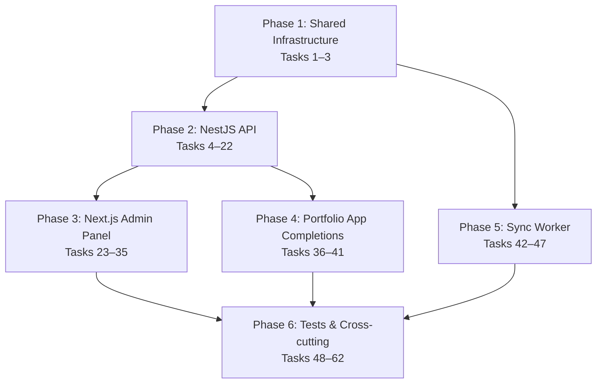

# Implementation Plan

## Overview

This plan covers 62 tasks across 6 phases to build the full OpenPortfolio platform. Phases 1–2 establish shared infrastructure and a NestJS API from scratch, Phase 3 builds a new Next.js admin panel, and Phases 4–5 complete the existing portfolio app and add a background sync worker. Phase 6 adds test infrastructure, 11 property-based correctness tests, and cross-cutting security, accessibility, and performance verification.

## Tasks

---

## Phase 1 — Shared infrastructure and registry

- [x] 1. Configure workspace monorepo structure
  - Add root `package.json` with npm/pnpm workspaces pointing at `api/`, `admin/`, `sync-worker/`, and `portfolio/packages/registry`
  - Add root `tsconfig.base.json` with shared compiler options (strict, ES2022, Node16 moduleResolution)
  - Confirm `@openportfolio/registry` package name in `portfolio/packages/registry/package.json` and that it resolves correctly from sibling apps
  - **Priority**: Must
  - **Requires**: none

- [x] 2. Provision shared environment configuration
  - Document all required env vars in a root `.env.example`: `MONGODB_URI`, `REVALIDATE_SECRET`, `SESSION_SECRET`, `FIELD_ENCRYPTION_KEY`, `AWS_*` / S3 vars, `PORTFOLIO_API_URL`, `NEXT_PUBLIC_ADMIN_URL`, `SMTP_*`
  - Confirm `portfolio/.env.example` is consistent with the shared list
  - **Priority**: Must
  - **Requires**: [1]

- [x] 3. Set up MongoDB connection module (shared utility)
  - Create `api/src/mongo/mongo.module.ts` with `MongooseModule.forRootAsync` reading `MONGODB_URI` from config
  - Define Mongoose schemas for all six collections: `users`, `portfolios`, `media`, `integrationConnections`, `integrationCache`, `linkHealth`, `auditLog` (see design.md §Data Model)
  - Add compound indexes as specified: unique `(provider, providerId)` on users, unique `email` on users, unique `userId` and unique `slug` on portfolios, sparse index on `portfolios.slugHistory`, `portfolioId` on media, `(portfolioId, provider)` unique compound on integrationCache, `(portfolioId, timestamp)` on auditLog
  - Export typed Mongoose documents and model injection tokens
  - **Priority**: Must
  - **Requires**: [1]

---

## Phase 2 — API (NestJS)

- [x] 4. Bootstrap NestJS application (`api/`)
  - Scaffold new NestJS project at `api/` with TypeScript, using `@nestjs/cli` or manual setup matching project conventions
  - Configure `main.ts`: cookie-session middleware (`express-session` with `SESSION_SECRET`), global `ValidationPipe` (whitelist, forbidNonWhitelisted), global `AllExceptionsFilter`
  - Wire `AppModule` importing `MongoModule`, `ConfigModule` (global), `ThrottlerModule`, `AuthModule`, `PublicModule`, `AdminModule`, `InternalModule`
  - Set `cookie: { httpOnly: true, secure: true, sameSite: 'lax', maxAge: 30 * 24 * 60 * 60 * 1000 }` on session
  - **Priority**: Must
  - **Requires**: [3]

- [x] 5. Implement credential encryption service
  - Create `api/src/common/encryption/field-encryption.service.ts`
  - `encrypt(plaintext: string): Buffer` — AES-256-GCM, random 12-byte IV prepended to ciphertext; key loaded once from `FIELD_ENCRYPTION_KEY` env var at module init, never logged
  - `decrypt(ciphertext: Buffer): string` — extracts IV prefix, decrypts
  - Unit-test round-trip and that different calls with the same plaintext produce different ciphertext (random IV)
  - **Priority**: Must
  - **Requires**: [4]

- [x] 6. Implement rich-text sanitiser
  - Create `api/src/common/sanitiser/rich-text.sanitiser.ts`
  - Use DOMPurify with jsdom as the DOM implementation (server-side)
  - Allowlist exactly: `ALLOWED_TAGS = ['p','ul','ol','li','strong','em','u','br']`, `ALLOWED_ATTR = []` — no attributes on any admitted tag, no anchors, no images, no scripts, no styles
  - Export `sanitiseRichText(html: string): string`
  - **Priority**: Must
  - **Requires**: [4]

- [-] 7. Implement GitHub OAuth strategy and Google OAuth strategy
  - Install `passport`, `passport-github2`, `passport-google-oauth20`, `@nestjs/passport`
  - Create `api/src/auth/github.strategy.ts` implementing `PassportStrategy(Strategy, 'github')`: validate callback upserts user by `(provider='github', providerId)`, stores encrypted GitHub OAuth token in `integrationConnections` for reuse (FR-AUTH-4)
  - Create `api/src/auth/google.strategy.ts` implementing `PassportStrategy(Strategy, 'google')`: validate callback upserts user by `(provider='google', providerId)`
  - On first sign-in: create `users` record and an unpublished `portfolios` document seeded with the `software-engineer` preset defaults; route to onboarding (FR-AUTH-2)
  - Create `api/src/auth/session.serializer.ts`: `serializeUser` stores `userId`, `deserializeUser` loads `User` document
  - Create `api/src/auth/auth.guard.ts`: `@Injectable` guard extending `AuthGuard` that checks `req.isAuthenticated()`; returns 401 if not
  - Create `api/src/auth/auth.controller.ts`: `GET /auth/github` → `passport.authenticate('github')`, `GET /auth/google` → `passport.authenticate('google')`, `GET /auth/callback/:provider` → handle OAuth redirect, `POST /auth/logout` → `req.logout()`
  - **Priority**: Must
  - **Requires**: [4, 5]

- [~] 8. Implement @Tenant() decorator and tenant isolation
  - Create `api/src/admin/decorators/tenant.decorator.ts`: custom param decorator that reads `req.session.portfolioId` and loads the `Portfolio` document; throws 401 if session missing, 404 if portfolio not found
  - `portfolio.service.ts` methods accept only a resolved `Portfolio` document — never a raw id from request body or URL — making cross-tenant access structurally impossible (FR-TEN-4, NFR-SEC-1)
  - **Priority**: Must
  - **Requires**: [7]

- [~] 9. Implement portfolio service (draft/publish lifecycle and section CRUD)
  - Create `api/src/portfolio/portfolio.service.ts`
  - `getDraft(portfolio)` — returns full draft tree
  - `updateTheme(portfolio, dto)` — patches `draft.theme`; rejects raw CSS/HTML/JS values (FR-THM-6)
  - `updateSeo(portfolio, dto)` — patches `draft.seo`
  - `updateSlug(portfolio, dto)` — validates uniqueness, checks against `RESERVED_LABELS`, writes old slug to `slugHistory` (FR-DAT-1, FR-DAT-2)
  - `getSections(portfolio)` — returns `draft.sections` ordered by `order`
  - `updateSection(portfolio, type, dto)` — patches `enabled`, `order`, or `content` on a single section; validates payload via `RegistryValidationPipe`
  - `addItem(portfolio, type, dto)` — appends to collection; enforces `max` cap from descriptor (FR-SEC-PROJ-2, FR-SEC-TEST-1)
  - `updateItem(portfolio, type, itemId, dto)` — partial item update
  - `deleteItem(portfolio, type, itemId)` — removes item; enforces `min` from descriptor
  - Sanitise `bodies.business`, `bodies.solution`, `bodies.role` through `rich-text.sanitiser.ts` on every write (FR-SEC-PROJ-12)
  - Write audit log entry on every mutation (NFR-SEC-6)
  - **Priority**: Must
  - **Requires**: [8, 6, 3]

- [x] 10. Implement registry validation pipe
  - Create `api/src/common/pipes/registry-validation.pipe.ts`
  - Calls `getDescriptor(type)` from `@openportfolio/registry`; validates each field against `FieldDescriptor.required`, `.max`, `.kind`, and `.options` (enum/multiselect)
  - Collects every failing field before returning; returns `FieldError[]` with HTTP 422 — never stops at the first failure (FR-API-4, FR-PUB-6)
  - Validates skill `rating` is integer 1–10 (Requirement 2.5.6)
  - Validates gallery video URLs against configured provider allowlist (FR-SEC-GAL-1)
  - **Priority**: Must
  - **Requires**: [4]

- [x] 11. Implement theme service (WCAG AA contrast check)
  - Create `api/src/theme/theme.service.ts`
  - `validateAccentColour(hex: string): { ok: true } | { ok: false; nearest: string }`
  - Compute relative luminance per WCAG 2.1 formula; require contrast ratio ≥ 4.5:1 against both `#FFFFFF` (light bg) and `#0F0F0F` (dark bg)
  - When failing: binary-search the HSL lightness axis to find the nearest compliant shade; always return it in the error response (FR-THM-3, Requirement 2.7.2)
  - **Priority**: Must
  - **Requires**: [4]

- [ ] 12. Implement publish service
  - Create `api/src/portfolio/publish.service.ts`
  - Validates `isSupportedRegistryVersion` before any other check
  - Runs `validateProjectsForPublish()` from registry (all 7 modal fields per project)
  - Validates prominent-skill count is 5–8 (FR-SEC-SKILL-3)
  - Validates per-section `emptyCondition` via `isSectionEmpty()` for all enabled sections
  - Validates project links: at least one of `demoUrl`/`repoUrl` present unless `confidential: true` (FR-SEC-PROJ-3, FR-SEC-PROJ-4)
  - Validates `impact` is non-empty on every project (FR-SEC-PROJ-5)
  - Collects **all** failures; returns `FieldError[]` with HTTP 422 if any exist — does not stop at first (FR-PUB-6)
  - On success: copies `draft` → `published`, increments `version`, sets `publishedAt`, sets `status: 'published'`
  - Calls `POST /internal/revalidate { slug }` to the portfolio app using `REVALIDATE_SECRET` (FR-PUB-7)
  - Writes audit log entry
  - **Priority**: Must
  - **Requires**: [9, 11, 10]

  - [~] 12.1. Implement unpublish
    - Sets `published: null`, `status: 'unpublished'`; does not touch draft (FR-PUB-8)
    - Calls revalidate endpoint so portfolio app returns 404 promptly
    - **Priority**: Should
    - **Requires**: [12]

- [~] 13. Implement media service (signed S3 URLs and WebP derivatives)
  - Create `api/src/media/media.service.ts`
  - `getUploadUrl(portfolioId, dto)`: verify `bytes ≤ 10 MB` and `altText` present (FR-MED-5, FR-MED-2, FR-MED-7); check per-tenant 200 MB cap; issue short-lived S3 presigned PUT URL; return `{ uploadUrl, key, finalUrl }` (FR-MED-1)
  - `confirmUpload(portfolioId, dto)`: fetch object from S3 by key, read magic bytes to verify MIME type matches declared type (JPEG=`FF D8 FF`, PNG=`89 50 4E 47`, WebP=`52 49 46 46`, SVG=text detection, PDF=`25 50 44 46`) (FR-MED-2)
  - SVG: pass through `sanitiseSvg()` — strip `<script>`, `on*` attrs, `href` on non-`<a>`/`<use>` elements, `<use>` pointing at external URLs; re-upload sanitised copy (FR-MED-3)
  - Non-SVG images: generate WebP derivatives at `[400, 800, 1200, 1600]` widths using `sharp`; upload each to S3; store `srcset` string in the `media` document (FR-MED-4)
  - `deleteMedia(portfolioId, mediaId)`: delete S3 object(s) and media document
  - **Priority**: Must
  - **Requires**: [4, 3]

- [x] 14. Implement SSRF validation utility
  - Create `api/src/integrations/ssrf.guard.ts`
  - `assertSafeUrl(url: string): Promise<void>`: parse URL, DNS-resolve hostname, reject if any resolved address falls in `10.0.0.0/8`, `172.16.0.0/12`, `192.168.0.0/16`, `127.0.0.0/8`, `169.254.0.0/16`, `::1`, `fc00::/7` (NFR-SEC-5)
  - `safeFetch(url, options)`: call `assertSafeUrl`, fetch with `redirect: 'manual'`, re-validate on each 3xx redirect hop recursively
  - Applied to: RSS `feedUrl` validation at write time, and all sync-worker outbound requests
  - **Priority**: Must
  - **Requires**: [4]

- [~] 15. Implement public API surface
  - Create `api/src/public/public.controller.ts` with `GET /public/portfolios/:slug`
  - Load published portfolio document; return 404 for unknown/unpublished/suspended slugs without disclosing registration status (FR-TEN-3)
  - Assemble `PortfolioPublicDto`: include only `slug`, enabled+ordered sections, `theme`, `seo`, `publishedAt`, `version` — strip `userId`, `draft`, disabled sections, credentials, analytics ids (FR-API-1, FR-TEN-5)
  - Merge `integrationCache` payloads into relevant sections server-side before serialisation (GitHub stats → `opensource.content.stats`, RSS posts → `blog.content.items` when no manual items exist per FR-INT-4)
  - Create `GET /public/portfolios/:slug/sitemap.xml` returning tenant sitemap (FR-PUB-5)
  - Apply `@nestjs/throttler` at 60 req/min per IP (FR-API-2)
  - Create `portfolio-public.dto.ts` using `class-transformer` with `@Exclude()` on all internal fields
  - **Priority**: Must
  - **Requires**: [9, 3]

- [~] 16. Implement admin API surface
  - Create `api/src/admin/admin.controller.ts` with all `/admin/*` endpoints listed in design.md §Admin Surface
  - Apply `AuthGuard` to the entire controller; every handler uses `@Tenant()` — no endpoint accepts a portfolioId in body or path (FR-API-3)
  - Wire: `GET /admin/me`, draft read/write, theme/SEO/slug patch, section list/patch/item CRUD, media upload-url/delete, integrations CRUD/sync, Credly import/badge, publish/unpublish, link-health read
  - All write handlers go through `RegistryValidationPipe`; return `FieldError[]` on 422 (FR-API-4)
  - **Priority**: Must
  - **Requires**: [8, 9, 12, 13, 10]

- [~] 17. Implement Credly import service
  - Create `api/src/credly/credly.service.ts`: `importCredlyBadges(portfolio, credlyUsername)` — calls `importCredlyBadges` from `@openportfolio/registry`; adds only badges not already present (FR-SEC-ACH-4); marks each imported item `published: false` (FR-SEC-ACH-5); returns `CredlyImportResultDto`
  - Create `api/src/credly/badge-extract.service.ts`: wraps `parseCredlyBadgeId` from registry; accepts pasted embed code, returns only the 36-char UUID, never stores the raw markup (FR-INT-14)
  - **Priority**: Should
  - **Requires**: [16]

- [~] 18. Implement integration connection management
  - Create `api/src/integrations/integrations.module.ts` and service
  - `connectGitHub(portfolio)`: reuses OAuth token from session (FR-AUTH-4); stores encrypted in `integrationConnections.credentials` via `FieldEncryptionService`
  - `connectRss(portfolio, feedUrl)`: validates `feedUrl` through `assertSafeUrl` before storing (FR-INT-8)
  - `triggerManualSync(portfolio, provider)`: queues or directly calls the relevant sync job
  - `disconnectProvider(portfolio, provider)`: removes connection record
  - Credentials are never included in any DTO response (FR-INT-6)
  - **Priority**: Should
  - **Requires**: [14, 5, 16]

- [~] 19. Implement internal revalidation controller
  - Create `api/src/internal/revalidate.controller.ts` with `POST /internal/revalidate`
  - `SharedSecretGuard` reads `Authorization: Bearer <REVALIDATE_SECRET>` header; rejects if secret unset or non-matching (constant-time compare)
  - Calls the portfolio app's `POST /api/internal/revalidate` with the same bearer token
  - **Priority**: Must
  - **Requires**: [4]

- [~] 20. Implement OG image generation
  - On publish when `seo.ogImageUrl` is absent: generate an OG image from tenant name, professional title, and accent colour (FR-PUB-3)
  - Use `@vercel/og` or `sharp`-based canvas; upload to S3; store URL in `published.seo.ogImageUrl`
  - **Priority**: Must
  - **Requires**: [12, 13]

- [~] 21. Implement slug 301-redirect lookup for slug history
  - On `GET /public/portfolios/:slug` 404: query `portfolios` where `slugHistory` contains the slug; if found and portfolio is published, return `301` to current slug's canonical URL (FR-DAT-2)
  - **Priority**: Should
  - **Requires**: [15]

- [~] 22. Implement analytics configuration storage
  - Add `analytics: { plausibleDomain?: string; gaMeasurementId?: string }` to draft/published `seo` shape
  - `PATCH /admin/portfolio/seo` accepts and stores analytics config (FR-ANL-1)
  - Public DTO includes analytics config only when set — never exposes the field as an empty object that indicates a configured-but-empty state
  - **Priority**: Should
  - **Requires**: [16]

---

## Phase 3 — Admin (Next.js)

- [~] 23. Bootstrap Next.js admin application (`admin/`)
  - Scaffold new Next.js 15 project at `admin/` with App Router, TypeScript, Tailwind
  - Configure `next.config.ts` with appropriate CSP (admin surface — stricter than portfolio, no Credly frame-src needed)
  - Add `lib/api-client.ts`: typed `fetch` wrapper for all `/admin/*` endpoints; reads session cookie automatically; surfaces `FieldError[]` from 422 responses
  - Add `lib/session.ts`: server-side session helpers using `next-auth` or direct cookie read
  - **Priority**: Must
  - **Requires**: [16]

- [~] 24. Implement OAuth sign-in page and session middleware
  - `app/sign-in/page.tsx`: renders GitHub and Google OAuth buttons linking to `/auth/github` and `/auth/google` on the API
  - Root `app/layout.tsx`: server-side session check; redirects unauthenticated requests to `/sign-in` (Requirement 3.1.1)
  - Session scope comes from the cookie — the admin app never passes tenant ids in URLs or bodies (FR-API-3)
  - **Priority**: Must
  - **Requires**: [23, 7]

- [~] 25. Implement onboarding flow
  - `app/onboarding/page.tsx`: single-step form collecting display name, desired slug (with live availability check via `GET /admin/portfolio/slug/available`), and preset selection
  - Live slug availability calls debounced to the API; shows green/red inline feedback
  - On submit: calls `PATCH /admin/portfolio/slug` and `PATCH /admin/portfolio/seo`; redirects to dashboard
  - **Priority**: Should
  - **Requires**: [24]

- [~] 26. Build registry-driven form engine
  - Create `components/forms/RegistryForm.tsx`: reads a `SectionDescriptor` from `@openportfolio/registry`, renders fields in `descriptor.fields` / `descriptor.itemFields` order — no hand-authored form code per section type (FR-REG-1, FR-REG-3)
  - Create `components/forms/FieldRenderer.tsx`: switches on `FieldKind` → correct input widget (text → `<input>`, longtext → `<textarea>`, url/email → validated `<input>`, tags → `TagInput`, boolean → `<checkbox>`, enum → `<select>`, image → `ImageUpload`, multiselect → multi-checkbox, number → `<input type="number">`, date → date input, list → repeating text inputs, link → `{ value, visible }` pair)
  - Renders fields in declared `descriptor.fields` / `descriptor.itemFields` order, identically for every collection item (FR-REG-2)
  - Shows `descriptor.help` text inline at the point of data entry (Requirement 3.2.3)
  - **Priority**: Must
  - **Requires**: [23]

- [~] 27. Build rich text editor widget
  - Create `components/forms/RichTextEditor.tsx`
  - Use a headless ProseMirror or Tiptap instance with toolbar restricted to: paragraphs, unordered list, ordered list, bold, italic, underline, line break — no anchor insert, no image insert, no arbitrary styling (FR-SEC-PROJ-12, Requirement 3.5.2)
  - Output is HTML string passed to `FieldRenderer` for `longtext` fields tagged `kind: 'richtext'` (or for `bodies.*` keys specifically)
  - **Priority**: Must
  - **Requires**: [26]

- [~] 28. Build image upload widget
  - Create `components/forms/ImageUpload.tsx`
  - On file select: calls `POST /admin/media/upload-url` to get a presigned URL; uploads bytes directly to S3 via `PUT`; calls `POST /admin/media/confirm` with the key
  - Shows alt-text input before upload is permitted — submit is blocked until alt text is non-empty (FR-MED-5)
  - Shows progress indicator during upload; shows CDN URL as a preview thumbnail on success
  - **Priority**: Must
  - **Requires**: [26, 13]

- [~] 29. Implement dashboard — section list with enable/disable and drag-reorder
  - `app/page.tsx` (dashboard): fetches `GET /admin/portfolio/sections`; renders `components/sections/SectionList.tsx`
  - `SectionList.tsx`: per-section enable/disable toggle → `PATCH /admin/portfolio/sections/:type { enabled }`; drag-to-reorder (use `@dnd-kit/core`) → `PATCH /admin/portfolio/sections/:type { order }` (FR-CFG-1, FR-CFG-3)
  - Shows advisory hints from `REGISTRY[type].description` for sections like Blog and Speaking (FR-CFG-6, Requirement 3.3.3)
  - **Priority**: Must
  - **Requires**: [26, 24]

- [~] 30. Implement section editors
  - `app/sections/[type]/page.tsx`: loads descriptor via `getDescriptor(type)`, renders `RegistryForm` for single sections or item list + `RegistryForm` per item for collection sections
  - Collection sections: supports create item (`POST /admin/portfolio/sections/:type/items`), edit item (`PATCH …/items/:itemId`), delete item (`DELETE …/items/:itemId`), item drag-reorder; item count constraints from `descriptor.min`/`descriptor.max` (Requirement 3.2.4)
  - Renders `bodies.*` fields through `RichTextEditor` widget
  - Displays `FieldError[]` returned by 422 responses adjacent to their fields (Requirement 3.1.4)
  - **Priority**: Must
  - **Requires**: [26, 27, 28, 29]

- [~] 31. Implement theme and SEO editors
  - `app/theme/page.tsx`: accent colour picker with live WCAG contrast feedback (calls `PATCH /admin/portfolio/theme`; shows nearest compliant shade on rejection per FR-THM-3); font-pairing selector; light/dark/system toggle
  - `app/seo/page.tsx`: page title, meta description, keywords, OG image upload, analytics id fields
  - **Priority**: Must
  - **Requires**: [28, 30]

- [~] 32. Implement live draft preview
  - `app/preview/page.tsx`: renders an `<iframe>` (or RSC route) that renders the draft using the same section components from the portfolio app; no client-side polling needed — re-renders on the next navigation (FR-CFG-5)
  - Alternatively: a Next.js route that imports section components directly and renders draft data; avoids cross-app dependency
  - **Priority**: Should
  - **Requires**: [30]

- [~] 33. Implement Credly import UI
  - `app/integrations/page.tsx` — Credly section: bulk import form (Credly username → `POST /admin/integrations/credly/import`); single badge embed-code paste (→ `POST /admin/integrations/credly/badge`)
  - Shows import result: N badges added, M already present (Requirement 5.5.1)
  - Imported badges default to unpublished; admin surfaces per-item publish toggle in the achievements section editor
  - **Priority**: Should
  - **Requires**: [30, 17]

- [~] 34. Implement publish/unpublish UI with field-level errors
  - `app/publish/page.tsx`: Publish button → `POST /admin/publish`; on 422, display every `FieldError` adjacent to its field with a link to the relevant section editor; on success, show confirmation with published URL
  - Unpublish button → `POST /admin/unpublish`; confirms intent before calling
  - **Priority**: Must
  - **Requires**: [30, 31]

- [~] 35. Implement integration management page
  - `app/integrations/page.tsx` — GitHub section: connect (reuses OAuth token), disconnect, show `status` and `lastSyncAt`, trigger manual sync; staleness indicator visible in admin only (FR-INT-3)
  - RSS section: feed URL input (validated client-side as a URL), connect → `POST /admin/integrations/rss`, trigger manual sync
  - Both sections show `lastError` and `consecutiveFailures` when `status: 'failing'`
  - **Priority**: Should
  - **Requires**: [29, 18]

---

## Phase 4 — Portfolio app completions

- [~] 36. Remove `USE_FIXTURES` branch from production builds
  - In `portfolio/lib/api.ts`, `useFixtures()` already guards the fixture branch at runtime — verify it returns `false` in production (NODE_ENV=production) regardless of USE_FIXTURES
  - No component changes needed; the fixture path stays for local development
  - Confirm `PORTFOLIO_API_URL` is documented in `.env.example` and raises a clear error when unset in production
  - **Priority**: Must
  - **Requires**: [15]

- [~] 37. Verify ISR cache invalidation end-to-end
  - Confirm `portfolio/app/api/internal/revalidate/route.ts` calls `revalidateTag(portfolioTag(slug))` — already implemented, verify it matches the tag used in `lib/api.ts`'s `fromApi`
  - Smoke-test: publish from API → revalidate endpoint fires → next public request gets fresh HTML within 60 seconds (FR-PUB-7)
  - **Priority**: Must
  - **Requires**: [19, 36]

- [~] 38. Implement branded 404 page
  - Verify `portfolio/app/not-found.tsx` renders a branded 404 with `noindex` meta tag; does not disclose whether the slug is registered (FR-TEN-3)
  - Check that both "unknown slug" and "unpublished slug" code paths reach this component — `getPortfolio` returning `null` should trigger `notFound()` in `app/page.tsx`
  - **Priority**: Must
  - **Requires**: [36]

- [~] 39. Implement sitemap.xml and robots.txt
  - `portfolio/app/sitemap.ts`: already present — verify it calls `getPortfolio` or a dedicated endpoint and emits correct `<url>` entries only for published portfolios (FR-PUB-5)
  - `portfolio/app/robots.ts`: already present — verify it emits `noindex` for unpublished/suspended slugs
  - **Priority**: Should
  - **Requires**: [15, 36]

- [~] 40. Implement analytics script injection
  - In `portfolio/app/layout.tsx`: read `payload.seo.analytics` from the portfolio payload; inject Plausible or GA script tag only when configured — no `<script>` when absent (FR-ANL-1, FR-ANL-3)
  - Use `next/script` with `strategy="afterInteractive"` to avoid blocking LCP
  - Confirm no platform-owned analytics is injected anywhere in the layout (FR-ANL-3)
  - **Priority**: Should
  - **Requires**: [36, 22]

- [~] 41. Verify Content Security Policy headers
  - Confirm `portfolio/next.config.ts` CSP matches the table in design.md §Security Model: `default-src 'self'`, `script-src` with Credly CDN and `unsafe-inline`, `img-src` with CDN + GitHub stat card origin + Credly images + `data:`, `frame-src` credly.com, `connect-src 'self'`, `style-src` + Google Fonts, `font-src` + Google Fonts CDN, `frame-ancestors 'none'` (NFR-SEC-4)
  - **Priority**: Must
  - **Requires**: [36]

---

## Phase 5 — Integrations and background sync worker

- [~] 42. Bootstrap sync worker project (`sync-worker/`)
  - Scaffold `sync-worker/` as a standalone TypeScript Node.js project (ts-node or compiled)
  - Install `node-cron`, `mongoose`, `nodemailer`
  - `src/mongo.ts`: Mongoose connection using shared `MONGODB_URI` env var
  - `src/worker.ts`: entry point; registers three cron jobs (GitHub every 6h, RSS every 3h, link health weekly); handles graceful shutdown
  - Share `@openportfolio/registry` and SSRF utility via workspace reference
  - **Priority**: Must
  - **Requires**: [3, 14]

- [~] 43. Implement scheduled job runner with exponential backoff
  - Create `sync-worker/src/scheduler.ts`: `ScheduledJob` wrapper around `node-cron`
  - On job failure: increment `integrationConnections.consecutiveFailures`; compute next delay as `min(baseBackoffMs * 2^n, maxBackoffMs)`; skip the next scheduled run if still within backoff window
  - On job success: reset `consecutiveFailures` to 0
  - **Priority**: Must
  - **Requires**: [42]

- [~] 44. Implement GitHub sync job
  - `sync-worker/src/jobs/github-sync.job.ts`
  - For each `integrationConnections` document with `provider: 'github'` and `status != 'revoked'`: fetch GitHub profile stats (repos, commits last 12 months, PRs, contributions) using the decrypted OAuth token
  - Upsert `integrationCache` record for that portfolio: `{ provider: 'github', payload, fetchedAt, expiresAt: +6h, stale: false }`
  - On fetch failure: set `stale: true` on existing cache record (if any), do not delete it (FR-INT-3); increment failure counter
  - All GitHub API calls through `safeFetch` (SSRF guard) (NFR-SEC-5)
  - **Priority**: Should
  - **Requires**: [43, 14]

- [~] 45. Implement RSS sync job
  - `sync-worker/src/jobs/rss-sync.job.ts`
  - For each `integrationConnections` with `provider: 'rss'`: fetch feed URL through `safeFetch`; parse RSS/Atom with a minimal parser; keep 10 most recent entries (FR-INT-8)
  - Upsert `integrationCache` record: `{ provider: 'rss', payload: { items: [...10] }, fetchedAt, expiresAt: +3h, stale: false }`
  - On failure: mark existing cache `stale: true` (FR-INT-3)
  - **Priority**: Should
  - **Requires**: [43, 14]

- [~] 46. Implement link health check job
  - `sync-worker/src/jobs/link-health.job.ts`
  - For each project item across all published portfolios: HEAD/GET the `demoUrl` and `repoUrl` through `safeFetch`; record status in `linkHealth` (FR-SEC-PROJ-9)
  - On failure: increment `consecutiveFailures`; when it reaches 2, send email notification to tenant (load email from `users` document) via `src/email.ts` (Requirement 5.6.2)
  - Never auto-remove a broken link — notification only (Requirement 5.6.3)
  - **Priority**: Should
  - **Requires**: [43, 14]

- [~] 47. Implement integration cache merge strategy
  - In `api/src/public/public.controller.ts` (task 15), when assembling the public DTO:
  - Load `integrationCache` records for the portfolio's active providers
  - Merge strategy: if manual value exists in `draft.content` / `published.content` → use it; else if cache record exists (stale or fresh) → use it; else → section satisfies `emptyCondition` and is omitted (FR-INT-4, FR-INT-5)
  - GitHub cache merges into `opensource.content.stats`; RSS cache merges into `blog.content.items` only when no manual items exist
  - **Priority**: Must
  - **Requires**: [15, 44, 45]

---

## Phase 6 — Test infrastructure, security, accessibility, performance

- [~] 48. Set up Vitest test infrastructure
  - Install `vitest`, `@vitest/coverage-v8`, `fast-check`, `mongodb-memory-server` as dev dependencies
  - Create `vitest.config.ts` at workspace root referencing projects: `@openportfolio/registry`, `@openportfolio/api`, `@openportfolio/admin`, `@openportfolio/portfolio`
  - Each project gets its own `vitest.config.ts`; shared setup file per project for test utilities
  - Add `"test": "vitest --run"` script to each `package.json`
  - **Priority**: Must
  - **Requires**: [1]

- [~] 49. Property test 1 — Reserved slug labels always rejected
  - File: `portfolio/packages/registry/src/__tests__/slug.property.test.ts`
  - Using `fast-check`: for every string in `RESERVED_LABELS`, `isValidSlug` returns `false`
  - For any alphanumeric-hyphen string not in the reserved list and ≤ 63 chars, `isValidSlug` returns `true`
  - **Validates**: Requirement 1.2.4
  - **Priority**: Must
  - **Requires**: [48]

- [~] 50. Property test 2 — Host-header slug extraction handles all inputs
  - File: `portfolio/lib/__tests__/tenant.property.test.ts`
  - For any host string where first DNS label is a reserved label: `resolveHost` returns `{ kind: 'rejected' }`
  - For any host string where first DNS label is a valid slug: `resolveHost` returns `{ kind: 'slug', slug }`
  - For IP addresses and apex domains: `resolveHost` returns `{ kind: 'noLabel' }`
  - **Validates**: Requirement 4.1.2
  - **Priority**: Must
  - **Requires**: [48]

- [~] 51. Property test 3 — Credly badge ID extraction is a partial function
  - File: `portfolio/packages/registry/src/__tests__/credly.property.test.ts`
  - For any string containing a Credly embed snippet, badge URL, or bare UUID: `parseCredlyBadgeId` returns exactly the 36-char UUID matching `[0-9a-f-]{36}` and nothing else
  - For any string containing no valid badge identifier: `parseCredlyBadgeId` returns `null`
  - For any non-null result: the returned string contains no HTML markup
  - **Validates**: Requirement 5.5.2
  - **Priority**: Must
  - **Requires**: [48]

- [~] 52. Property test 4 — Rich-text sanitisation removes all disallowed content
  - File: `api/src/common/sanitiser/__tests__/rich-text.property.test.ts`
  - For any HTML string containing disallowed elements (anchors, images, scripts, iframes, style attrs, event handlers, elements not in `['p','ul','ol','li','strong','em','u','br']`): sanitised output contains none of those elements or attributes
  - For any string with only allowed elements and no attributes: sanitised output preserves text content
  - **Validates**: Requirements 2.5.4, 6.2.1
  - **Priority**: Must
  - **Requires**: [6, 48]

- [~] 53. Property test 5 — Public DTO never leaks internal fields
  - File: `api/src/public/__tests__/portfolio-public-dto.property.test.ts`
  - For any portfolio document containing `userId`, `email`, `draft`, disabled section instances, `credentials`, `oauthToken`: serialised `PortfolioPublicDto` contains none of those fields
  - For any disabled section in the source document: `sections` array in the DTO does not contain that section
  - **Validates**: Requirements 1.3.1, 2.2.2
  - **Priority**: Must
  - **Requires**: [15, 48]

- [~] 54. Property test 6 — Publish collects all field errors at once
  - File: `api/src/portfolio/__tests__/publish.property.test.ts`
  - For any draft where N distinct required fields are empty or invalid: a publish attempt returns exactly N `FieldError` entries in a single response, not stopping at the first failure
  - **Validates**: Requirement 1.3.3
  - **Priority**: Must
  - **Requires**: [12, 48]

- [~] 55. Property test 7 — Cross-tenant isolation holds for all admin endpoints
  - File: `api/src/admin/__tests__/cross-tenant.property.test.ts`
  - For any two distinct tenant sessions A and B: any admin endpoint called with session A reads and writes only portfolio A's data, regardless of what portfolio identifiers appear in body or URL path
  - Use `mongodb-memory-server` for integration-level test with two real tenant documents
  - This doubles as the automated cross-tenant test suite required by Requirement 2.4.2
  - **Validates**: Requirement 2.4.1
  - **Priority**: Must
  - **Requires**: [16, 48]

- [~] 56. Property test 8 — SSRF validation rejects all private address targets
  - File: `api/src/integrations/__tests__/ssrf.property.test.ts`
  - For any URL whose hostname resolves to an address in a private/link-local range: `assertSafeUrl` throws
  - For any redirect chain where any hop resolves to a private address: `safeFetch` throws before completing
  - Use `fast-check` to generate addresses within each private CIDR block
  - **Validates**: Requirement 5.3.3
  - **Priority**: Must
  - **Requires**: [14, 48]

- [~] 57. Property test 9 — Accent colour validation always offers a compliant alternative
  - File: `api/src/theme/__tests__/theme.property.test.ts`
  - For any hex colour that fails WCAG AA contrast against both light (`#FFFFFF`) and dark (`#0F0F0F`) backgrounds: `validateAccentColour` returns `{ ok: false, nearest: <hex> }` where `nearest` passes WCAG AA against both
  - **Validates**: Requirement 2.7.2
  - **Priority**: Must
  - **Requires**: [11, 48]

- [~] 58. Property test 10 — Registry field order is invariant across collection items
  - File: `portfolio/packages/registry/src/__tests__/registry.property.test.ts`
  - For any collection section type: the sequence of `itemFields[*].key` for item at index 0 equals the sequence for the item at any other index; order matches `descriptor.itemFields.map(f => f.key)` exactly
  - **Validates**: Requirements 1.1.1, 1.1.2
  - **Priority**: Must
  - **Requires**: [48]

- [~] 59. Property test 11 — Skill numeric rating is always present as text in rendered output
  - File: `portfolio/components/sections/Skills/__tests__/skills.property.test.tsx`
  - For any `SkillItem` with a `rating` value between 1 and 10: rendered HTML contains the string representation of the rating as a visible text node, not conveyed by bar length or colour alone
  - Render with `@testing-library/react`
  - **Validates**: Requirements 4.5, 6.3
  - **Priority**: Must
  - **Requires**: [48]

- [~] 60. Cross-tenant isolation integration test suite
  - File: `api/src/admin/__tests__/admin.controller.spec.ts`
  - Spin up two real tenant accounts in `mongodb-memory-server`
  - For every `/admin/*` endpoint: call it using Tenant A's session while supplying Tenant B's portfolio id / item ids in body and path; assert every response reflects Tenant A's data only (NFR-SEC-1, Requirement 2.4.2)
  - This is distinct from property test 7 — it exercises real HTTP handlers end-to-end, not just the service layer
  - **Priority**: Must
  - **Requires**: [16, 48]

- [~] 61. Performance verification
  - Configure `@vercel/speed-insights` or Lighthouse CI in CI pipeline against a staging deployment
  - Assert LCP < 2.5 s, CLS < 0.1 on a simulated 4G connection (NFR-PERF-2)
  - Assert p95 uncached render < 800 ms (NFR-PERF-1)
  - Confirm public page render performs at most one MongoDB read (add instrumentation or test double) and zero server-side external HTTP calls (NFR-PERF-3)
  - **Priority**: Must
  - **Requires**: [37, 47]

- [~] 62. Accessibility audit (WCAG 2.1 AA)
  - Run `axe-core` (via `@axe-core/playwright` or `jest-axe`) against all rendered portfolio section components and admin forms
  - Manual checklist: project modal focus trap (Tab/Shift+Tab cycle, open→close button, close→card, Escape key, backdrop click) per Requirement 4.4.5–8; skill bar accessible name and numeric text per NFR-A11Y-3; Credly badge frame accessible name per NFR-A11Y-6; email `mailto:` client-side assembly per FR-SEC-CON-3
  - Verify keyboard navigation: every interactive element reachable by Tab with visible focus indicator (NFR-A11Y-2)
  - Verify modal ARIA attributes: `role="dialog"`, `aria-modal="true"`, `aria-labelledby` → project title heading, close button `aria-label="Close case study"`, hit area ≥ 44×44 px (FR-SEC-PROJ-13)
  - **Priority**: Must
  - **Requires**: [30, 34]

## Task Dependency Graph



```json
{
  "waves": [
    {
      "wave": 1,
      "tasks": [1]
    },
    {
      "wave": 2,
      "tasks": [2, 3, 48]
    },
    {
      "wave": 3,
      "tasks": [4, 49, 50, 51, 58, 59]
    },
    {
      "wave": 4,
      "tasks": [5, 6, 10, 11, 13, 14, 19]
    },
    {
      "wave": 5,
      "tasks": [7, 42, 52, 56, 57]
    },
    {
      "wave": 6,
      "tasks": [8, 43]
    },
    {
      "wave": 7,
      "tasks": [9, 44, 45, 46]
    },
    {
      "wave": 8,
      "tasks": [12, 15]
    },
    {
      "wave": 9,
      "tasks": [12.1, 16, 20, 21, 36, 47, 53, 54]
    },
    {
      "wave": 10,
      "tasks": [17, 18, 22, 23, 37, 38, 39, 41, 55, 60]
    },
    {
      "wave": 11,
      "tasks": [24, 26, 40, 61]
    },
    {
      "wave": 12,
      "tasks": [25, 27, 28, 29, 35]
    },
    {
      "wave": 13,
      "tasks": [30]
    },
    {
      "wave": 14,
      "tasks": [31, 32, 33]
    },
    {
      "wave": 15,
      "tasks": [34]
    },
    {
      "wave": 16,
      "tasks": [62]
    }
  ]
}
```

## Notes

- **What already exists:** the `portfolio/` Next.js app (sections, UI components, ISR, preview) and `portfolio/packages/registry` (section descriptors, validation helpers, slug utilities) are already in place and are completed/verified rather than built from scratch.
- **What is built from scratch:** `api/` (NestJS, Mongoose, OAuth, all admin and public endpoints), `admin/` (Next.js 15 admin panel with registry-driven form engine), and `sync-worker/` (Node.js cron-based background process for GitHub, RSS, and link-health jobs) are all new projects scaffolded during this plan.
- **Test strategy:** Phase 6 sets up Vitest with `fast-check` for property-based testing; 11 correctness properties cover slug validation, tenant isolation, DTO field leakage, SSRF, WCAG contrast, sanitisation, and more — supplemented by `mongodb-memory-server` integration tests and Lighthouse CI for performance and `axe-core` for accessibility.
